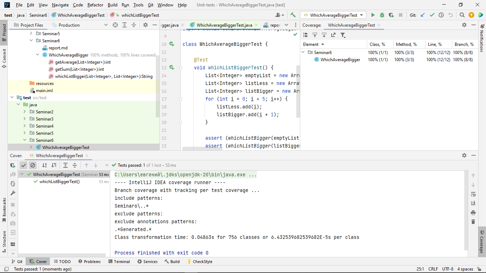

# Отчет о покрытии тестами

# Объяснение того, какие сценарии покрыты тестами и почему вы выбрали именно эти сценарии.
- assert (whichListBigger(emptyList, emptyList).equals("Средние значения равны"));
проверяет, что пустые списки возвращают ноль. Для этого создаем пустые списки.
- assert (whichListBigger(listLess, listEqualLess).equals("Средние значения равны")); проверяет, что среднее значение двух одинаковых списков равны, для этого создаем два списка с одинаковым средним значением.
- assert (whichListBigger(listBigger, listLess)).equals("Первый список имеет большее среднее значение"); проверяет, что среднее число у списка с большим средним больше, чем у списка с меньшим средним числом. Для этого создаем списки с большим и меньшим числом.
- assert (whichListBigger(listLess, listBigger)).equals("Второй список имеет большее среднее значение"); проверяет, тоже что и прошлый тест, только в обратном порядке - меньшее число с большим.